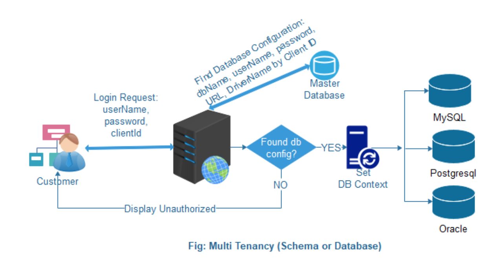
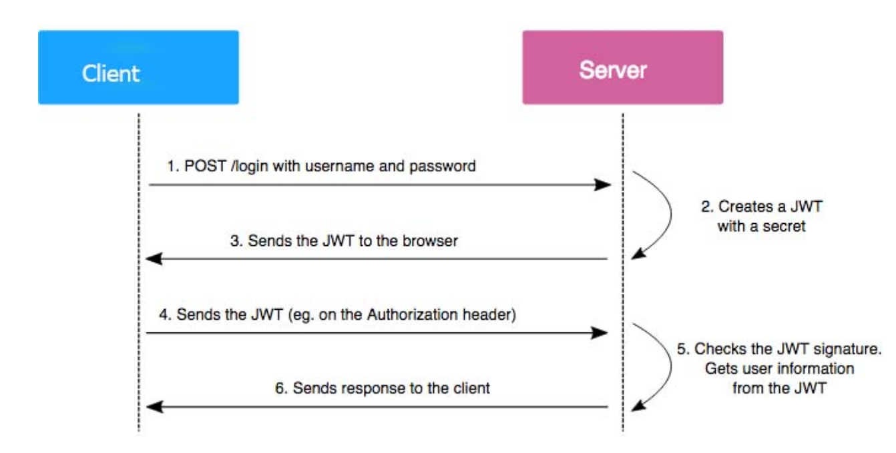
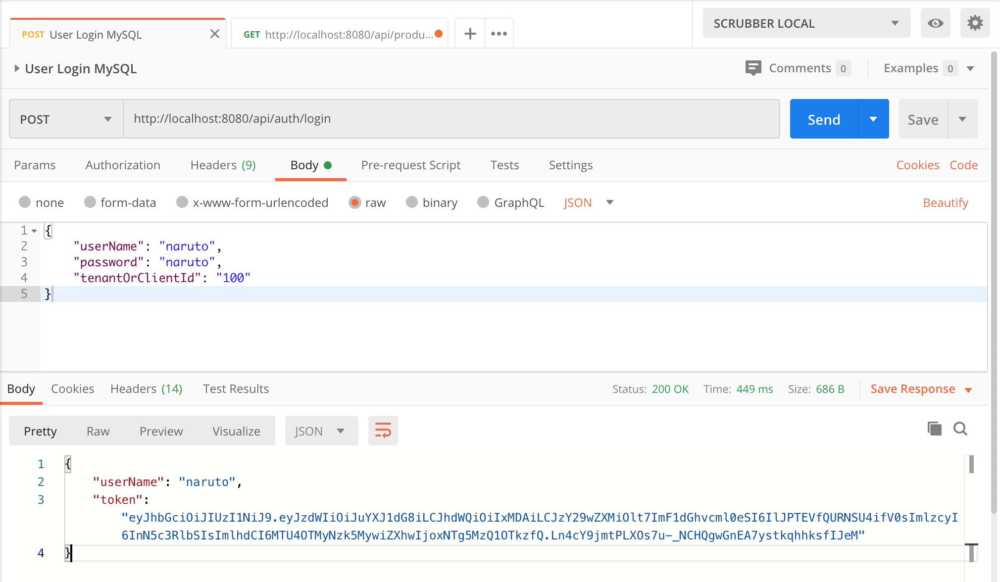
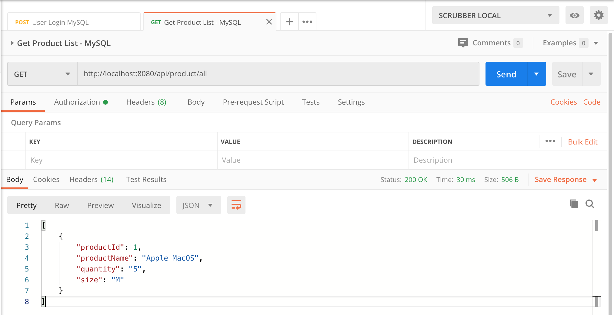
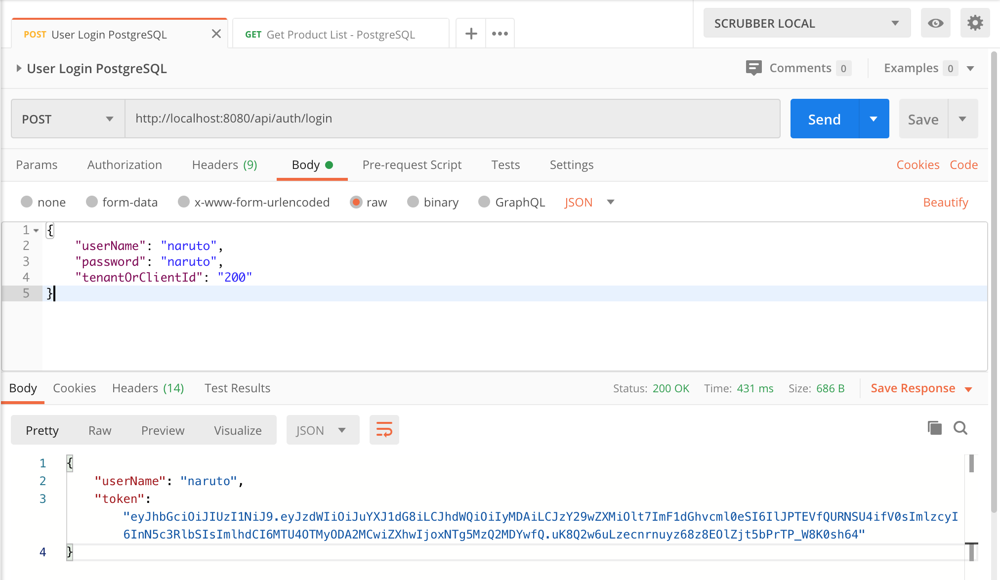

copied from 
https://github.com/hendisantika/SpringBoot-Security-JWT-Rest-API-Dynamic-Multi-Tenancy-MySQL-PostgreSQL.git

modified and reolved issue
################################################################################################################################
# SpringBoot-Security-JWT-Rest-API-Dynamic-Multi-Tenancy-MySQL-PostgreSQL
### Purpose

I wanted a solution where multi-tenancy is achieved by having a database per-tenant and all user information (username, password, client Id, etc.) for authentication and authorization stored in a user table in the respective tenant databases. This means that not only did I need a multi-tenant application, but also a secure application like any other web application secured by Spring Security.

I know how to use Spring Security to secure a web application and how to use Hibernate to connect to a database. The requirement further dictates that all users belonging to a tenant need to be stored in the tenant database and not a separate or central database. This would allow for complete data isolation for each tenant.

### Goal

* Archive Application SaaS Model client wise different database.
* Focus Spring Security and JWT
* You can connect multiple schemas with a single database, like MySQL — testdb, testdb2.
* You can connect multiple databases, like MySQL, PostgreSQL, or Oracle.

### What Is Multi-Tenancy?

Multi-tenancy is an architecture in which a single instance of a software application serves multiple customers. Each client is called a tenant. Tenants may be given the ability to customize some parts of the application.

A multi-tenant application is where a tenant (i.e. users in a company) feels that the application has been created and deployed for them. In reality, there are many such tenants, and they too are using the same application but get a feeling that it's built just for them.

Dynamic Multi-Tenant High-Level Diagram:



Here,
* Client requests to login to the system.
* The system checks with the master database using client Id.
* If it's successful, set the current database to context based on the driver class name.
* If this fails, the user gets the message, "unauthorized".
* After successful authentication, the user gets a JWT for the next execution.

The whole process executes in the following workflow:



Technology and Project Structure:
* Java 11.
* Spring Boot.
* Spring Security.
* Spring AOP.
* Spring Data JPA.
* Hibernate.
* JWT.
* MySQ & PostgreSQL.
* IntelliJ IDEA Ultimate (2020.1).

### MySQL Database
Now, Create a Master Database and a tenant database.

Master Database:

In the master database, we only have one table (tbl_tenant_master), where all tenant information is storeed in the table.
MySQL 

```sql
DROP TABLE IF EXISTS `tbl_tenant_master`;
CREATE TABLE `tbl_tenant_master` (
  `tenant_client_id` int(10) unsigned NOT NULL,
  `db_name` varchar(50) NOT NULL,
  `url` varchar(250) NOT NULL,
  `user_name` varchar(50) NOT NULL,
  `password` varchar(100) NOT NULL,
  `driver_class` varchar(100) NOT NULL,
  `status` varchar(10) NOT NULL,
  PRIMARY KEY (`tenant_client_id`) USING BTREE
) ENGINE=InnoDB DEFAULT CHARSET=utf8mb4;

INSERT INTO `tbl_tenant_master` (`tenant_client_id`, `db_name`, `url`, `user_name`, `password`, `driver_class`, `status`) VALUES
('100', 'tenant_db', 'jdbc:mysql://localhost:3306/tenant_db?useUnicode=true&useJDBCCompliantTimezoneShift=true&useLegacyDatetimeCode=false&serverTimezone=Asia/Jakarta&useSSL=false', 'root', 'root', 'com.mysql.cj.jdbc.Driver', 'ACTIVE'),
('200', 'tenant_db_pgs', 'jdbc:postgresql://localhost:5432/tenant_db_pgs', 'hendisantika', 'root', 'org.postgresql.Driver', 'ACTIVE'),
('300', 'tenant_db2', 'jdbc:mysql://localhost:3306/tenant_db?useUnicode=true&useJDBCCompliantTimezoneShift=true&useLegacyDatetimeCode=false&serverTimezone=Asia/Jakarta&useSSL=false', 'root', 'root', 'com.mysql.cj.jdbc.Driver', 'ACTIVE');

```
Tenant Database (1) in MySQL:

Create a table for client login authentication(tbl_user).

Create another table (tbl_product) to retrieve data using a JWT (for Authorization checks).
MySQL 
```sql
DROP TABLE IF EXISTS `tbl_product`;
CREATE TABLE `tbl_product` (
  `product_id` int(10) unsigned NOT NULL AUTO_INCREMENT,
  `product_name` varchar(50) NOT NULL,
  `quantity` int(10) unsigned NOT NULL DEFAULT 0,
  `size` varchar(3) NOT NULL,
  PRIMARY KEY (`product_id`)
) ENGINE=InnoDB AUTO_INCREMENT=2 DEFAULT CHARSET=utf8mb4;

DROP TABLE IF EXISTS `tbl_user`;
CREATE TABLE `tbl_user` (
  `user_id` int(10) unsigned NOT NULL AUTO_INCREMENT,
  `full_name` varchar(100) NOT NULL,
  `gender` varchar(10) NOT NULL,
  `user_name` varchar(50) NOT NULL,
  `password` varchar(100) NOT NULL,
  `status` varchar(10) NOT NULL,
  PRIMARY KEY (`user_id`)
) ENGINE=InnoDB AUTO_INCREMENT=2 DEFAULT CHARSET=utf8mb4;

INSERT INTO `tbl_product` (`product_id`, `product_name`, `quantity`, `size`) VALUES
('1', 'Apple MacOS', '5', 'M');

INSERT INTO `tbl_user` (`user_id`, `full_name`, `gender`, `user_name`, `password`, `status`) VALUES
('1', 'Uzumaki Naruto', 'Male', 'naruto', '$2y$12$/WhepH7JVYUCl4ujy6FFguiCi/x2q4dwXISD.WJTXYIN2QAhv6Zky', 'ACTIVE'); -- password=naruto
```

Tenant Database (2) in PostgreSQL:

Create a table for client login authentication (tbl_user).

Create another table (tbl_product) to retrieve data using a JWT (for authorization checks).
PostgreSQL
```sql
DROP TABLE IF EXISTS "public"."tbl_product";
-- This script only contains the table creation statements and does not fully represent the table in the database. It's still missing: indices, triggers. Do not use it as a backup.

-- Table Definition
CREATE TABLE "public"."tbl_product" (
                                        "product_id" int4 NOT NULL,
                                        "product_name" varchar(50) NOT NULL,
                                        "quantity" int4 NOT NULL DEFAULT 0,
                                        "size" varchar(3) NOT NULL,
                                        PRIMARY KEY ("product_id")
);

DROP TABLE IF EXISTS "public"."tbl_user";
-- This script only contains the table creation statements and does not fully represent the table in the database. It's still missing: indices, triggers. Do not use it as a backup.

-- Table Definition
CREATE TABLE "public"."tbl_user" (
                                     "user_id" int4 NOT NULL,
                                     "full_name" varchar(100) NOT NULL,
                                     "gender" varchar(10) NOT NULL,
                                     "user_name" varchar(50) NOT NULL,
                                     "password" varchar(100) NOT NULL,
                                     "status" varchar(10) NOT NULL,
                                     PRIMARY KEY ("user_id")
);

INSERT INTO "public"."tbl_product" ("product_id", "product_name", "quantity", "size") VALUES
('1', 'Apple MacOS', '5', 'M');

INSERT INTO "public"."tbl_user" ("user_id", "full_name", "gender", "user_name", "password", "status") VALUES
('1', 'Uzumaki Naruto', 'Male', 'naruto', '$2y$12$/WhepH7JVYUCl4ujy6FFguiCi/x2q4dwXISD.WJTXYIN2QAhv6Zky', 'ACTIVE');
```

Database creation and table creation are done!

### Configure Tenant Database.

In this section, we'll work to understand multitenancy in Hibernate. There are three approaches to multitenancy in Hibernate:
* Separate Schema — one schema per tenant in the same physical database instance.
* Separate Database — one separate physical database instance per tenant.
* Partitioned (Discriminator) Data — the data for each tenant is partitioned by a discriminator value.
 
### Database Data checks:
Master Database data:

    tbl_tenant_master
 
```sql
MariaDB [master_db]> select * from tbl_tenant_master;
+------------------+---------------+---------------------------------------------------------------------------------------------------------------------------------------------------------------+--------------+----------+--------------------------+--------+
| tenant_client_id | db_name       | url                                                                                                                                                           | user_name    | password | driver_class             | status |
+------------------+---------------+---------------------------------------------------------------------------------------------------------------------------------------------------------------+--------------+----------+--------------------------+--------+
|              100 | tenant_db     | jdbc:mysql://localhost:3306/tenant_db?useUnicode=true&useJDBCCompliantTimezoneShift=true&useLegacyDatetimeCode=false&serverTimezone=Asia/Jakarta&useSSL=false | root         | root     | com.mysql.cj.jdbc.Driver | ACTIVE |
|              200 | tenant_db_pgs | jdbc:postgresql://localhost:5432/tenant_db_pgs                                                                                                                | hendisantika | root     | org.Postgresql.Driver    | ACTIVE |
|              300 | tenant_db2    | jdbc:mysql://localhost:3306/tenant_db?useUnicode=true&useJDBCCompliantTimezoneShift=true&useLegacyDatetimeCode=false&serverTimezone=Asia/Jakarta&useSSL=false | root         | root     | com.mysql.cj.jdbc.Driver | ACTIVE |
+------------------+---------------+---------------------------------------------------------------------------------------------------------------------------------------------------------------+--------------+----------+--------------------------+--------+
3 rows in set (0.010 sec)

```

Tenant Database (MySQL) Table Data:

    tbl_user
    tbl_product

```sql
MariaDB [tenant_db]> select * from tbl_user;
+---------+----------------+--------+-----------+--------------------------------------------------------------+--------+
| user_id | full_name      | gender | user_name | password                                                     | status |
+---------+----------------+--------+-----------+--------------------------------------------------------------+--------+
|       1 | Uzumaki Naruto | Male   | naruto    | $2y$12$/WhepH7JVYUCl4ujy6FFguiCi/x2q4dwXISD.WJTXYIN2QAhv6Zky | ACTIVE |
+---------+----------------+--------+-----------+--------------------------------------------------------------+--------+
1 row in set (0.002 sec)

MariaDB [tenant_db]> select * from tbl_product;
+------------+--------------+----------+------+
| product_id | product_name | quantity | size |
+------------+--------------+----------+------+
|          1 | Apple MacOS  |        5 | M    |
+------------+--------------+----------+------+
1 row in set (0.000 sec)

```

### Tenant Database (PostgreSQL) Tables Data:

    tbl_user
    tbl_product
```sql
tenant_db_pgs=# select * from tbl_user;
 user_id |   full_name    | gender | user_name |                           password                           | status 
---------+----------------+--------+-----------+--------------------------------------------------------------+--------
       1 | Uzumaki Naruto | Male   | naruto    | $2y$12$/WhepH7JVYUCl4ujy6FFguiCi/x2q4dwXISD.WJTXYIN2QAhv6Zky | ACTIVE
(1 row)

tenant_db_pgs=# select * from tbl_product;
 product_id | product_name | quantity | size 
------------+--------------+----------+------
          1 | Apple MacOS  |        5 | M
(1 row)

```

Now, test that everything works as we expect using Postman:

Target MySQL:

User Login in MySQL



Get Product List in MySQL

 

Target PostgreSQL:

User Login in PostgreSQL



Get Product List in PostgreSQL

 

NOTE:
BCrypt Online Generator:
1. https://bcrypt-generator.com/
2. Lupa lagi. Nanti diupdate dech
